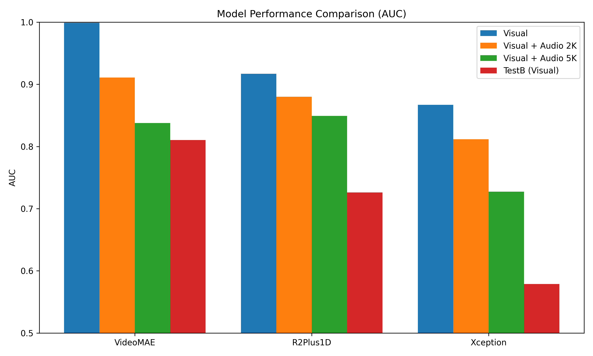

# Deepfake Detection Model Comparison

This project implements and compares three different deep learning architectures for deepfake video detection: **Xception**, **R(2+1)D**, and **VideoMAE V2**. The project is designed to run on high-performance computing clusters (using Slurm) and includes scripts for training, inference, and evaluation on the AV-Deepfake1M-PlusPlus dataset.

> **Note for TAs / Instructors:** Please refer to [example.md](example.md) for a quick guide containing the exact commands and configurations used to produce our results on the cluster.

## 🚀 Key Features

*   **Multi-Model Support**:
    *   **Xception**: A strong 2D CNN baseline for frame-level analysis.
    *   **R(2+1)D**: A 3D CNN architecture for capturing spatiotemporal features.
    *   **VideoMAE V2**: A masked autoencoder based video transformer for state-of-the-art video understanding.
*   **Pipeline**: Complete workflow from data loading to training, inference, and AUC evaluation.
*   **HPC Ready**: Includes Slurm scripts (`scripts/*.sh`) for distributed training on clusters.

## 📂 Project Structure

```
deepfake_project/
├── data/               # Data loading and dataset classes
├── models/             # Model architectures and main scripts
│   ├── train.py        # Main training script (PyTorch Lightning)
│   ├── infer.py        # Inference script for generating predictions
│   ├── evaluate.py     # Evaluation script (AUC calculation)
│   ├── R2_1D.py        # R(2+1)D model definition
│   ├── videomae_v2.py  # VideoMAE V2 model definition
│   └── xception.py     # Xception model definition
├── helper/             # Utility scripts (See helper/README.md)
│   ├── combine.py      # Merge result files
│   ├── plot.py         # Visualize comparison results
│   ├── cut_json.py     # JSON manipulation
│   └── ...
├── scripts/            # Slurm job submission scripts
│   ├── final_mae.sh
│   ├── final_r2plus1d.sh
│   └── final_xception.sh
├── ckpt/               # Directory for saving model checkpoints
└── output/             # Inference results and logs
```

## 🛠️ Setup

1.  **Environment**: Ensure you have a Conda environment set up with PyTorch and necessary dependencies, specifically with Python 3.10.
    ```bash
    conda create -n cv_env python=3.10
    conda activate cv_env
    ```
2.  **Dependencies**: Key libraries include `torch`, `lightning`, `torchvision`, `timm`, `transformers`, `pandas`, and `decord`.
    ```bash
    pip install -r requirements.txt
    ```

## 📊 Usage

### 1. Training

Training is handled by `models/train.py`. You can run it locally or submit it via Slurm using the scripts in the `scripts/` directory.

**Common Arguments:**
*   `--data_root`: Path to the dataset root directory.
*   `--train_metadata`: Path to the training metadata JSON.
*   `--val_metadata`: Path to the validation metadata JSON.
*   `--model`: Choose from `xception`, `r2plus1d`, `videomae_v2`.
*   `--batch_size`: Batch size per GPU.

**Example (VideoMAE V2):**
```bash
python models/train.py \
  --data_root /path/to/dataset \
  --train_metadata train.json \
  --val_metadata val.json \
  --model videomae_v2 \
  --batch_size 8 \
  --gpus 1 \
  --max_epochs 50
```

**Job Submission (Slurm):**
```bash
sbatch scripts/final_mae.sh
```

### 2. Inference

Generate prediction scores for a test set using `models/infer.py`. This script produces a text file where each line corresponds to a video and its fake probability.

```bash
python models/infer.py \
  --data_root /path/to/dataset \
  --checkpoint ckpt/videomae_v2/best_model.ckpt \
  --model videomae_v2 \
  --metadata_file test.json \
  --subset test \
  --batch_size 32 \
  --gpus 1
```

### 3. Evaluation

Calculate the AUC score using the generated prediction file.

```bash
python models/evaluate.py output/videomae_v2_test.txt test.json
```

### 4. Utilities

See `helper/README.md` for detailed instructions on using utility scripts.

*   **Combine Results**:
    ```bash
    python helper/combine.py output/part1.txt output/part2.txt 
    ```
*   **Plot Results**:
    ```bash
    python helper/plot.py
    ```

## 📈 Results

The project generates a comparison plot `grouped_model_auc.png` showing the AUC performance of the three models across different test subsets (Visual, Audio-Visual 2K/5K, TestB).



---
*Created for the Computer Vision Final Project.*

## 📧 Contact

For any questions or inquiries, please open an issue in this repository or contact the project contributors directly.

## 🙏 Acknowledgements

We would like to thank [VideoMAEv2](https://github.com/OpenGVLab/VideoMAEv2) and [AV-Deepfake1M](https://github.com/ControlNet/AV-Deepfake1M/tree/master).
